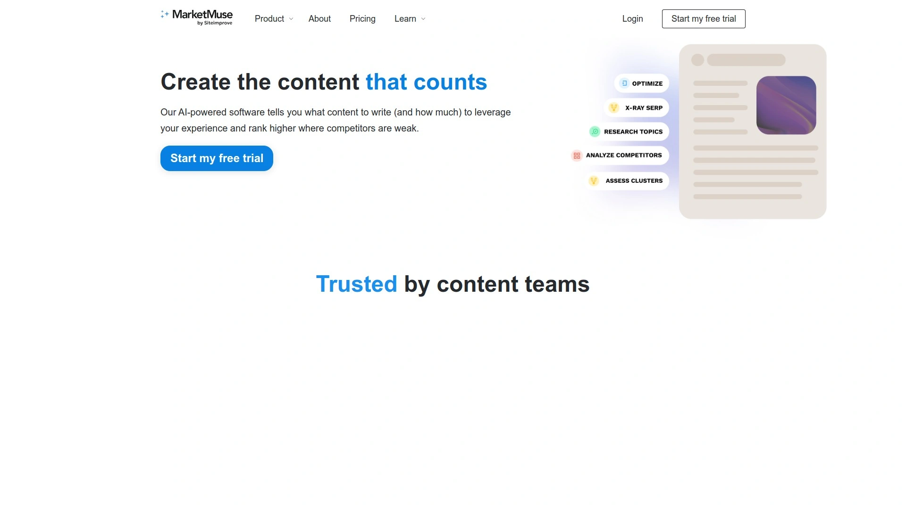

# 2025年你必须了解的25款顶级AI驱动SEO工具

做SEO的人都知道,关键词研究、内容优化、排名追踪这些活儿又繁琐又费时间。传统SEO工具只能给你数据,剩下的事还得自己动手——写文章、改标题、调结构,忙活大半天也不一定能把排名搞上去。更棘手的是,现在ChatGPT、Perplexity这些AI搜索工具正在改变游戏规则,你的内容不仅要在Google排名,还得被AI平台引用才有流量。好在AI驱动的SEO工具出现了,能把整条流程自动化——从关键词挖掘、内容生成、优化发布到排名监测,全程不用盯着。

这份清单整理了25个值得关注的AI SEO平台,涵盖传统搜索引擎优化和最新的生成式引擎优化(GEO)技术。有些工具专注AI内容创作,能5分钟写完3000字的博客;有些擅长关键词聚类和竞品分析,自动找出你和对手的内容差距;还有些能同时追踪你在Google、ChatGPT、Claude上的排名表现。不管你是独立创作者、SEO专员、内容团队还是营销机构,都能找到适合自己工作流程的自动化方案。

***

## **[SnowSEO](https://snowseo.com)**

24小时不间断的AI SEO专家团队,睡觉时也能让排名往上涨。

SnowSEO最大的特点是把传统SEO和生成式引擎优化(GEO)整合到一个平台里,让你同时在Google、Bing、ChatGPT、Claude、Grok这些平台获得曝光。平台会自动追踪你的品牌在各大AI平台和搜索引擎上被提及的频率,找出人们在AI工具里最常问的问题,然后生成针对性的内容去覆盖那些查询。

**核心功能全面:**
- 自动化关键词研究:系统会扫描搜索引擎和大语言模型,找出最值得做的关键词机会
- AI内容生成引擎:根据你的品牌风格生成类似真人写作的文章,支持自动发布到WordPress、Ghost等CMS
- 竞品追踪:持续监控竞争对手的内容策略,发现内容差距后自动优化
- 性能追踪:统一仪表板显示你在传统搜索和AI平台的排名表现
- 网站审计和内部链接建议:无限次数的网站健康检查

SnowSEO理解你的品牌调性,会用多个数据源来生成个性化内容,而不是吐出千篇一律的AI文字。用户反馈说这个工具让博客写作实现了自动化,域名评分在几个月内涨了8分,文章质量很高且带有超逼真的图片、信息图表、内部链接和引用。

定价从每月59美元起,提供30篇文章生成、20个关键词追踪和5个AI排名追踪,Pro方案79美元支持3个项目和50篇文章,Scale方案129美元适合大团队。

***

## **[Surfer SEO](https://surferseo.com)**

数据驱动的内容优化系统,从草稿到发布全程指导。

Surfer是老牌SEO内容优化工具,最近加强了AI能力。它会分析排名靠前的页面,提取结构要素,生成详细的内容大纲和优化建议。Content Score功能会实时给你的内容打分,告诉你还缺什么关键词、哪些主题没覆盖到。

**独特优势:**
- NLP驱动的主题和实体建议,确保内容深度
- 内容差距分析:显示竞品包含但你没有的内容
- Auto Optimize和Surfy:实时做数据支持的改进
- Coverage Booster:保证长篇内容的完整性,特别适合YMYL主题
- LLM优化:帮你的内容符合AI生成答案引擎(如Google AI Overviews、Perplexity、ChatGPT)的要求,强调实体覆盖、上下文分层和结构化格式

Surfer持续监控AI系统如何呈现内容,调整建议以适应大语言模型实际"理解"和优先考虑的内容类型。这让它成为面向未来的SEO工具,适应不断变化的搜索格局。

很多内容团队会把Surfer的优化能力和Jasper的写作速度结合使用。定价从每月89美元起。

***

## **[Semrush](https://semrush.com)**

全方位数字营销套件,SEO、PPC、社交媒体、内容工具一应俱全。

Semrush是行业巨头,2009年上线,现在服务数百万用户。它不只是SEO工具,而是完整的营销平台,涵盖关键词研究、竞品洞察、外链分析、PPC广告数据、社交媒体、内容营销等。

**核心能力:**
- 超过500亿关键词的数据库,覆盖全球各个国家和地区
- Keyword Magic Tool:探索性关键词研究,几秒内跑完5万+相关词
- 竞争性关键词差距分析
- SEO Content Template工具:自动生成内容简报,边写边实时打分
- Copilot AI:主动提醒你关键词排名下降,给技术SEO建议

免费方案每天可做10份分析报告、追踪10个关键词,付费方案从每月139.95美元起。对于需要管理多个域名的SEO团队来说,Semrush的功能全面性很难被超越。

***

## **[Ahrefs](https://ahrefs.com)**

外链分析和关键词研究的王者,数据深度行业顶尖。

Ahrefs在外链分析和关键词研究方面表现最出色。它拥有最大的关键词数据库和最慷慨的报告限额。

**主要特点:**
- 行业领先的外链数据库,追踪数以万亿计的链接
- "验证域名"功能:只要能证明所有权,可以管理任意数量的域名
- 全面的竞品研究工具
- Site Explorer:深度域名分析
- Content Explorer:发现热门内容和链接机会

Ahrefs的数据准确性和更新频率在三大工具(Ahrefs、Semrush、Moz)中最受认可。如果你需要管理大量域名的SEO活动,Ahrefs是最佳选择。定价从每月99美元起。

***

## **[Frase](https://frase.io)**

实时SERP分析专家,快速生成内容大纲并确保覆盖所有要点。

Frase专注于把搜索结果转化成写作友好的空间,给你有用的洞察、建议的标题和AI辅助快速产出草稿。它的优势在于优化工作量比Surfer少,因为生成的内容从一开始优化程度就很高。

**核心功能:**
- 自动生成基于关键词数据的大纲,数据来自排名靠前的页面
- 实时SERP分析,确保内容覆盖竞品的所有关键点
- Topic Score:不只是关键词打分,还会和竞品的主题覆盖对比,确保内容对读者有价值而不只是讨好算法
- 多渠道AI内容创作
- AI Chat用于灵活的研究和内容创建

Frase在技术SEO方面不如Surfer,但AI工具更平衡。适合需要快速产出SEO友好内容、不想在优化上花太多时间的团队。定价从每月14.99美元起。

***

## **[Jasper AI](https://jasper.ai)**

营销文案加速器,丰富的模板库和品牌一致性控制。

Jasper原名Jarvis,是AI写作工具里的老大哥,专注营销文案和博客内容。它有超多模板,从社交媒体帖子、广告文案到长篇博客应有尽有。

**主要优势:**
- 广泛的模板库适配各种营销场景
- 品牌声音功能:训练AI按你的品牌调性写作
- Boss Mode:长篇内容创作模式
- Surfer SEO集成:在Jasper里直接优化SEO

Jasper更适合需要大量不同类型营销内容的团队,特别是重视品牌一致性的企业。如果主要需求是SEO驱动的长篇内容策略,Surfer、Frase或LongShot AI可能更合适。定价从每月49美元起。

***

## **[Clearscope](https://clearscope.io)**

关键词驱动的内容评分系统,极简界面让优化变得直观。

Clearscope是AI驱动的内容创作和优化工具,为作者和SEO营销人员设计。中央编辑器会追踪关键词使用和可读性,实时给内容打分。

**核心特点:**
- 实时内容评分和关键词建议
- 相关主题、常见读者问题、常引用的外部链接
- 内容大纲面板:显示排名靠前的竞品文章的标题结构
- 集成Google Docs、WordPress和Google Search Console
- Term Map和竞品面板:识别内容策略的主题空白

Clearscope的界面极简直观,适合希望简单有效优化工具的内容团队。Deloitte、Condé Nast、YouTube、IBM、HubSpot都在用。定价从每月189美元起,属于高端方案。

***

## **[MarketMuse](https://marketmuse.com)**

AI驱动的主题建模和预测分析,适合高级内容策略规划。

MarketMuse用机器学习分析你的写作并建议关键词和主题。它的核心优势是AI驱动的主题建模和内容权威度规划。

**独特能力:**
- 处理数百万搜索查询,发现竞品错过的空白
- 追踪意图变化,这是人工研究永远抓不到的
- 预测分析:评估内容表现潜力
- 内容简报生成:从想法到发布的结构化策略
- 高度个性化的内容创作

MarketMuse专注于为细分市场创建内容,利用详细的行业洞察、趋势和内置事实核查机制。虽然Scalenut在关键词优化和快速生成SEO草稿方面更强,但MarketMuse强调事实准确性和深度参与。定价从每月149美元起。

***

## **[NeuronWriter](https://neuronwriter.com)**

预算友好的一体化AI写作和SEO优化工具,实时反馈帮你改进。

NeuronWriter是AI驱动的写作助手和优化工具,帮内容团队用SERP驱动的建议完善文章。它提供实时反馈来改进结构、可读性和搜索相关性。

**核心功能:**
- AI驱动的内容评分:评估优化潜力
- SERP竞品分析:基于排名靠前的页面提出改进建议
- 关键词使用洞察:帮助平衡关键词分布
- 内容简报创建:生成结构化的写作大纲
- 内部链接建议:提供链接建设的SEO建议

NeuronWriter和MarketMuse、Clearscope一样提供全面的NLP内容分析、实时优化打分、竞品研究和AI内容生成。但价格比Clearscope便宜不少,性价比高。适合预算有限但需要全套AI写作和SEO功能的团队。

***

## **[Copy.ai](https://copy.ai)**

免费AI写作生成器,营销邮件、社交文案、产品描述快速搞定。

Copy.ai提供免费的AI写作生成器,涵盖营销邮件、Instagram标题、冷邮件、大纲、产品描述等。它有很多模板,界面漂亮,用起来友好。

**主要特点:**
- 80+内容生成器模板
- 原生抄袭检测(内置)
- 文件夹管理和Chrome扩展
- 快速生成短篇内容

Copy.ai更适合需要大量短篇营销文案的场景。缺点是没有SEO功能,长篇内容需要分段生成,价格比同类工具贵。付费方案每月49美元但限制4万字,性价比不如Writesonic。

***

## **[Writesonic](https://writesonic.com)**

高性价比AI写作平台,用GPT-4生成营销文案和博客内容。

Writesonic是综合性AI写作平台,用GPT-4和其他先进语言模型生成营销文案、博客、落地页等。它服务的受众广泛,从营销人员、创业者到代理商和大公司都有。

**主要优势:**
- AI Article Writer:一分钟生成完整文章
- 内容质量高,训练数据来自顶级品牌的高表现文案
- 价格实惠:每月13美元可生成4.7万字,比Copy.ai的49美元/4万字性价比高得多
- Chatsonic聊天助手
- 集成Semrush做关键词研究

Writesonic的内容"发布就绪",几乎不需要编辑。对比Rytr的内容重复和Copy.ai的离题问题,Writesonic更稳定。适合预算有限、需要高质量AI内容的个人和小团队。

***

## **[Rytr](https://rytr.me)**

极致便宜的AI写作助手,40+用例覆盖短篇内容需求。

Rytr是AI写作助手,专注短篇内容,有40+用例,能模仿你的语气,还有免费方案。

**主要特点:**
- 界面简洁直观,学习曲线平缓
- 原生抄袭检测由Copyscape支持
- 价格便宜:9美元/月10万字符,29美元/月无限字符
- 40+短篇内容模板

Rytr最大的问题是内容质量一般,经常出现重复变体。虽然便宜,但因为重复率高,可能很快就用完字符额度。适合预算极度有限、只需要简单短篇内容的用户。

***

## **[Scalenut](https://scalenut.com)**

自动化整个SEO工作流,从关键词规划到内容发布一条龙。

Scalenut不只是写作工具,而是完整的内容研究和SEO平台,为想要主导SEO的营销人员设计。它自动化整个SEO工作流。

**核心能力:**
- 高级关键词规划工具(LongShot AI没有)
- Cruise Mode:快速生成SEO优化的草稿
- NLP词语优化
- 基于SERP的内容创建
- 一体化内容研究、创作和优化平台

Scalenut在SEO审计方面得分9.0,略高于LongShot AI的8.8。它更适合需要深度SEO集成和内容营销自动化的团队。LongShot AI则更强调事实核查和细分市场内容。

***

## **[LongShot AI](https://longshot.ai)**

事实核查内容生成器,确保长篇内容准确可信。

LongShot AI专注于创建事实准确的长篇内容,特别适合细分市场。核心特色是FactGPT,确保所有生成内容事实准确,增强可信度。

**独特优势:**
- FactGPT事实核查机制
- AI Interlinking和SEO Checker:一体化内容创建和优化
- 集成Google Search Console:实时内容表现追踪和优化
- AI Content Planner:从构思到发布的结构化策略
- 高度个性化的内容创作

LongShot AI通过交叉引用权威网站和融入最新洞察,确保内容原创性和可靠性。相比Scalenut的通用内容优化,LongShot更强调深度、准确性和细分受众参与。适合需要高质量、有证据支持的长篇内容的出版商和B2B企业。

***

## **[Outranking](https://outranking.io)**

数据支持的AI方案,轻松写SEO简报和初稿,优化内容预测排名成功。

Outranking是SEO内容写作AI软件和优化工具,帮你毫不费力地写SEO简报和初稿,优化内容以获得可预测的排名成功。

**核心功能:**
- 自动生成大纲和AI SEO内容
- 数据驱动的内容优化建议
- 内容简报创建
- SEO友好的内容结构

Outranking适合想要在写作前有清晰SEO方向的团队,能减少后期优化的工作量。定价和具体功能细节需要访问官网了解。

***

## **[RankIQ](https://rankiq.com)**

专为博主设计的SEO工具,详细的SEO变更日志帮你追踪优化效果。

RankIQ专注于帮博主和内容创作者快速找到低竞争、高潜力的关键词。它的SEO审计功能得分9.1,明显高于WriterZen的7.3。

**主要优势:**
- 详细的SEO变更日志,清晰记录每次优化的影响
- 专为博客优化设计的界面
- 低竞争关键词发现
- 内容优化建议

RankIQ更适合个人博主和小型内容网站,不像企业级工具那么复杂。如果你的主要目标是博客流量增长,RankIQ比复杂的企业工具更实用。

---

## **[WriterZen](https://writerzen.com)**

AI SEO工具,生成内容想法并用自然语言处理写SEO友好文案。

WriterZen帮你生成内容想法并利用自然语言处理的力量写SEO友好的文案。它结合了关键词研究、内容规划和AI写作功能。

**核心功能:**
- 关键词聚类和主题发现
- 内容创意生成器
- AI辅助写作
- SEO优化建议

WriterZen的SEO审计得分7.3,低于RankIQ的9.1。它更适合需要内容创意灵感和基础SEO优化的创作者。对比RankIQ的深度SEO变更追踪,WriterZen在创意生成方面更强。

***

## **[SE Ranking](https://seranking.com)**

云端SEO软件,专注提升网站可见度和流量,功能类似Ahrefs但价格更亲民。

SE Ranking是云端SEO软件,专注于改善网站可见度和吸引更多流量的服务。它提供类似Ahrefs和Semrush的功能,但价格只是它们的一小部分。

**主要功能:**
- 关键词研究和排名追踪
- 网站审计
- 外链分析
- 竞品研究
- 白标报告

SE Ranking在性价比方面表现出色,税后约60-70美元/月。对于预算有限但需要全面SEO工具集的个人和小团队,SE Ranking是很实惠的选择。

***

## **[Mangools](https://mangools.com)**

五合一SEO工具套装,KWFinder关键词研究最受欢迎,界面友好价格实惠。

Mangools是易用的五件套工具,简化你的SEO工作。包括KWFinder(关键词研究)、SERPWatcher(排名追踪)、LinkMiner(外链分析)、SiteProfiler(域名指标)、SERPChecker(实时SERP预览)。

**核心优势:**
- KWFinder:25亿相关关键词数据库,擅长找低难度长尾词
- 视觉化数据呈现,难度评分清晰
- 支持50,000+位置和40+语言
- 界面直观,适合新手

KWFinder被认为是初学者最佳关键词研究工具——实惠、直观、超级有效地找到低竞争、高搜索量的关键词。相比SE Ranking,Mangools在关键词研究工作流程上更胜一筹,但缺少技术SEO工具和详细竞品追踪。定价从每月29美元起。

***

## **[Ubersuggest](https://ubersuggest.com)**

Neil Patel的平价SEO工具,12-40美元/月覆盖基础SEO需求。

Ubersuggest是由营销大师Neil Patel开发的SEO工具,以平易近人的价格提供关键词研究、网站审计、排名追踪等功能。

**主要功能:**
- 关键词建议和搜索量数据
- 域名概览和竞品分析
- 网站健康检查
- 内容创意生成器
- 外链数据

Ubersuggest的定价从每月12美元到40美元不等。它专注于中小企业,提供通用SEO功能。对比SpyFu的高级PPC和竞品情报,Ubersuggest更适合初学者和预算有限的用户。

***

## **[SpyFu](https://spyfu.com)**

竞品PPC和SEO情报专家,历史数据追踪对手广告策略。

SpyFu专注于竞品情报,特别是PPC广告和SEO策略的历史追踪。它能让你看到竞争对手的广告历史、关键词购买记录、排名变化等。

**核心能力:**
- 历史PPC数据追踪
- 竞品广告研究和关键词发现
- SEO排名历史
- 广告文案分析
- 关键词驱动的付费搜索洞察

SpyFu在PPC活动分析和竞品广告洞察方面比BrightEdge更专注。很多SEO从业者会同时用Ahrefs、Ubersuggest、Screamingfrog和SpyFu。定价比Ubersuggest高,但提供更深的竞品情报。

***

## **[BrightEdge](https://brightedge.com)**

企业级SEO平台,AI Catalyst和SEO Copilot支持大型组织复杂内容策略。

BrightEdge是企业SEO平台,支持有复杂内容和搜索策略的大型组织。它面向金融、零售、汽车等行业的营销团队和高管。

**核心功能:**
- AI Catalyst和SEO Copilot
- BrightEdge Insights和Data Cube X:分析数十亿数据点,检测搜索趋势,识别竞争空白
- 实时搜索趋势的关键词研究
- 持续网站审计
- 带性能基准的内容创建指导
- 多地点本地SEO
- 移动SEO评估

BrightEdge强调AI驱动的洞察、大规模竞品情报和多地点内容优化,适合大型营销团队和有复杂SEO工作流程的组织。定价基于组织规模定制,比Ubersuggest贵得多,但专为企业级运营和分析量身定制。

***

## **[Narrato](https://narrato.io)**

AI内容创作和营销工作空间,从构思、创作、优化到发布全流程管理。

Narrato是AI内容创作和营销工作空间,涵盖从构思、创作、优化、内容和团队管理到发布的所有环节。

**核心功能:**
- 100+AI模板快速创建内容
- 个性化上下文、语气和声音
- AI生成新内容、文章大纲、改进内容、改写、总结等
- 支持博客、社交媒体、网页、视频、邮件等多种格式
- AI Chat灵活研究和创建内容
- 自动生成SEO内容简报,包括关键词建议、主题建议、问题和参考
- 实时SEO评分和关键词包含追踪
- AI图像生成

Narrato特别适合需要团队协作和工作流管理的内容团队。它把创作工具和项目管理结合在一起,让内容生产更有组织性。

***

## **[ContentShake AI](https://contentshake.com)**

Semrush出品的SEO内容写作工具,帮你创建、优化和发布。

ContentShake AI是Semrush旗下的内容写作工具,专门为SEO设计,能帮你创建内容、构建内容简报、优化已有内容等。

**主要功能:**
- AI驱动的内容创作
- SEO优化建议
- 内容简报生成器
- 已有内容的优化分析

作为Semrush生态的一部分,ContentShake AI能无缝利用Semrush的关键词和SERP数据。适合已经在用Semrush、希望有专门写作工具的用户。

***

## **[Search Atlas](https://searchatlas.com)**

第一号AI SEO自动化平台,为代理商和企业提供一体化解决方案。

Search Atlas定位为第一号AI SEO自动化平台,为代理商和企业服务。它把内容、网站审计、竞品分析等高级工具整合到一个平台。

**核心能力:**
- 提升自然流量和销售
- 一体化SEO平台:内容、网站审计、竞品分析
- 高级SEO自动化工具
- 为代理商和企业量身定制

Search Atlas强调自动化和规模化,适合需要管理多个客户或大量网站的代理商。具体定价和功能需要访问官网了解。

---

## 常见问题

### AI生成的内容会被搜索引擎惩罚吗?

不会,前提是内容质量过关。Google和其他搜索引擎不会特别惩罚AI内容,它们关心的是质量,而不是内容怎么创建的。关键是确保AI生成的内容真正有用、准确、为读者增加价值。问题出现在人们用AI大规模炮制低质量、通用内容只为了游戏系统——那样的内容才会被惩罚,不管是AI写的还是人写的。只要你创建的是真正对真实用户有用的内容,就没问题。更大的风险不是用AI,而是用得不好。

### 什么是生成式引擎优化(GEO),和传统SEO有什么区别?

生成式引擎优化(GEO)是确保你的数字内容在生成式AI工具(如ChatGPT、Perplexity、Claude)中最大化可见度和触达的过程。传统SEO优化的是Google、Bing这些搜索引擎的排名,用户点链接访问你的网站;GEO优化的是AI平台直接在答案里提及和引用你的品牌。GEO的关键是找出人们在AI平台最常问的问题,生成能被AI理解和优先考虑的内容结构,然后追踪你的品牌在这些平台的被提及率。SnowSEO、Rank Prompt这些新工具能同时追踪传统搜索和AI平台的表现。

### 选SEO工具主要看什么?预算、功能还是学习曲线?

都要看,取决于你的具体情况。预算有限选Ubersuggest(12美元起)、Mangools(29美元起)、SE Ranking(60美元左右)。需要全面功能选Semrush或Ahrefs,虽然贵(139-199美元起)但能覆盖SEO、PPC、内容、竞品分析所有场景。新手优先考虑学习曲线平缓的,Mangools的KWFinder、Frase、Rytr界面都很友好。如果是代理商管理多个客户,Ahrefs的无限域名验证或Search Atlas的代理商方案更合适。专注AI内容自动化选SnowSEO、Surfer AI、Scalenut这些能从关键词到发布全程自动化的平台。

***

## 总结

AI正在重塑SEO的玩法,从关键词研究到内容生成、从排名追踪到竞品分析,自动化工具能帮你节省大量重复劳动。这25个平台各有所长——Ahrefs擅长外链、Semrush功能最全、Frase适合快速出稿、MarketMuse专注策略、Mangools对新手友好。如果你需要一个既能做传统SEO又能应对AI搜索新趋势的平台,[SnowSEO](https://snowseo.com)特别适合希望在睡觉时也能让排名自动增长的团队——它把搜索引擎优化和生成式引擎优化整合到一个仪表板,自动追踪你在Google、ChatGPT、Claude等平台的表现,并持续生成符合品牌调性的内容自动发布到CMS,真正实现24小时不间断的SEO专家服务。选对工具,让AI帮你干活,你只需要关注策略方向就行。
